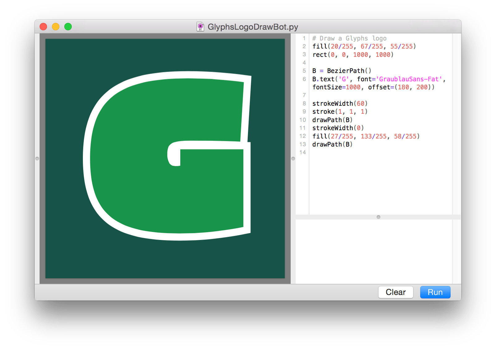

# DrawBot Glyphs Plugin

[DrawBot](http://drawbot.readthedocs.org/) inside [Glyphs](http://glyphsapp.com).

Make a new drawBot from the File menu > New DrawBot, or open a file with cmd+O. Save or Save As as usual. Run the script by hitting the Run button (or pressing cmd+⏎). Clean the output area by pressing cmd+K.

To save a drawing as pdf, hit cmd+E (or File > Export..)

## Installation and requirements

To install, double click the `DrawBot.glyphsPlugin` file. It requires at least Glyphs 2.1.1 (777).

The plugin needs these packages. They can be installed from within Glyphs in Preferences > Addons.
* [vanilla](https://github.com/typesupply/vanilla) 
* [robofab](https://github.com/robofab-developers/robofab)
* [fontTools](http://sourceforge.net/projects/fonttools/)

### Includes 
* [DrawBot](http://drawbot.readthedocs.org/) 
* [pygments](http://pygments.org)

## Many thanks to:
- Just van Rossum, Erik van Blokland, Frederik Berlaen for making DrawBot.
- [Jens Kutilek](http://www.kutilek.de) for helping with implementing the plugin.
